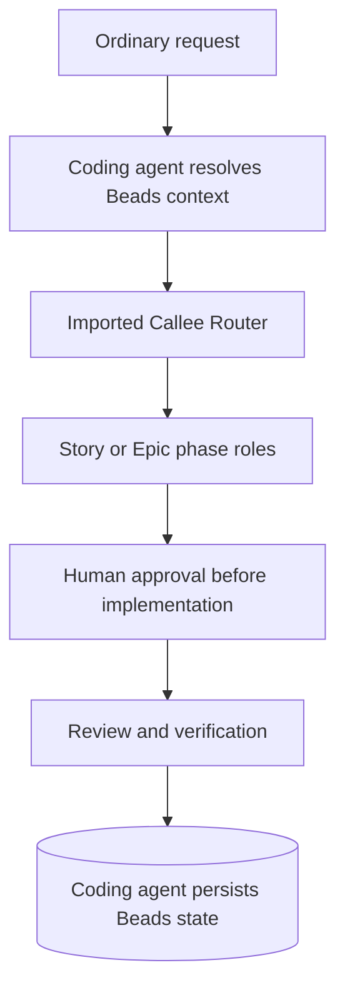

# Prism Callee

Prism Callee runs Story and Epic workflows through specialized Callee agents.
Lifecycle state lives in [Beads](https://github.com/gastownhall/beads).

[Prism](https://github.com/baldaworks/prism) is the primary coding agent skill repository. Start there for coding agent workflows: [router](https://github.com/baldaworks/prism/blob/main/plugins/prism/skills/lifecycle/SKILL.md), [Story](https://github.com/baldaworks/prism/blob/main/plugins/prism/skills/story/SKILL.md), and [Epic](https://github.com/baldaworks/prism/blob/main/plugins/prism/skills/epic/SKILL.md).
Each repository installs and validates independently. Installing one plugin does
not install the other.

## Quick start

```text
$prism-callee:lifecycle Add CSV export to the report page.
```

| Workflow | Codex | Claude Code | Flat-slash coding agents |
| --- | --- | --- | --- |
| lifecycle | `$prism-callee:lifecycle` | `/prism-callee:lifecycle` | `/prism-callee-lifecycle` |

## Requirements

- A supported coding agent and `bd` (Beads).
- `callee` `0.19.0` or a compatible Router-capable release, and the imported `prism/*` pack.

## Installation

### Codex

```sh
codex plugin marketplace add baldaworks/prism-callee
codex plugin add prism-callee@prism-callee
```

Refresh using `codex plugin marketplace upgrade prism-callee`, repeat the plugin
add command, and start a new thread.

### Claude Code

```sh
claude plugin marketplace add baldaworks/prism-callee
claude plugin install prism-callee@prism-callee --scope user
```

### Grok Build

```sh
grok plugin install 'baldaworks/prism-callee#plugins/prism-callee' --trust
```

### GitHub Copilot CLI

```sh
copilot plugin marketplace add baldaworks/prism-callee
copilot plugin install prism-callee@prism-callee
```

### Cursor

```sh
agent plugin marketplace add https://github.com/baldaworks/prism-callee.git
```

Install **prism-callee** from the marketplace UI.

### OpenCode v2

Requires OpenCode 2.x. Install Prism Callee from the Git repository:

```sh
opencode plugin add 'github:baldaworks/prism-callee#main'
```

Invoke `/prism-callee-lifecycle`. The package registers the bundled skill and
keeps its supporting references available.

### Agent Plugins 1.0.0

The portable package root is `plugins/prism-callee/`; clients discover its immediate
child skills under `skills/`. Use your client's installation workflow.

## Install or update the Callee agents

Initial import:

```sh
callee agent import baldaworks/prism-callee \
  --path pack/callee/prism \
  --prefix prism
```

Update or repair an existing import:

```sh
callee agent import baldaworks/prism-callee \
  --path pack/callee/prism \
  --prefix prism \
  --force
```

Validate the default catalog:

```sh
callee agent list | grep '^prism/'
callee agent view prism/lifecycle --json
callee agent view prism/story --json
callee agent view prism/epic --json
bd where
```

The lifecycle must report kind `Router`. A `Sequential` lifecycle or missing
Story/Epic root means the import is stale; refresh with `--force`.
`--agent-root pack/callee` is for repository maintenance only.

## Workflows

Prism Callee exposes three complete workflow graphs. Use the
[lifecycle router](pack/callee/prism/lifecycle.md) through the coding-agent
wrapper for the recommended managed experience:

```text
$prism-callee:lifecycle Add CSV export to the report page.
```

The wrapper resolves the Beads target, persists phase labels, and supports
resuming the selected Story or Epic.

Run the complete [Story workflow](pack/callee/prism/story.md) directly when the
target and lifecycle state are already explicit:

```sh
callee agent run prism/story --message "Add CSV export to the report page."
```

Run the complete [Epic workflow](pack/callee/prism/epic.md) the same way:

```sh
callee agent run prism/epic --message "Coordinate CSV export across reporting services."
```

Direct Story and Epic runs execute the full imported graphs, but they do not
automatically resolve a Beads item, persist phase labels, or provide the
plugin's resume behavior. Use `$prism-callee:lifecycle` when durable lifecycle
management is required. Individual phase roles are implementation details and
are not standalone user entrypoints.

## Lifecycle



The coding agent owns durable state and approval. Callee executes the selected graph;
approval never transfers from an Epic to a Story.


## Migration from the combined repository

Replace the old `prism-callee@prism` installation with `prism-callee@prism-callee` using the installation commands above and your coding agent's uninstall workflow. Force-import the agents from `baldaworks/prism-callee` to replace the old source while retaining the `prism/*` names.
Public invocation names and existing Beads labels remain compatible.
Remote installation commands require the split repositories to be published;
pre-publication verification uses the local package roots.

## Learn more

See [Callee architecture](docs/architecture-callee-lifecycle.md),
[Human smoke tests](docs/callee-lifecycle-smoke-test.md), and
[extraction provenance](docs/extraction-provenance.json). Repository ownership,
validation, and publication guidance lives in [CONTRIBUTING](CONTRIBUTING.md).

Only explicit human intent authorizes Apply.

## License

MIT — see [LICENSE](LICENSE).
