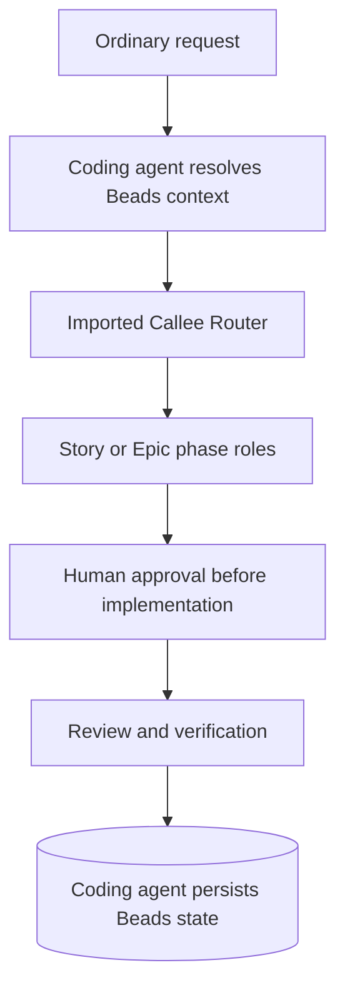

# Prism Callee

Prism Callee runs Story and Epic workflows through specialized Callee agents.
Lifecycle state lives in [Beads](https://github.com/gastownhall/beads).

[Prism](https://github.com/baldaworks/prism) is the primary coding agent skill repository. Start there for coding agent workflows: [router](https://github.com/baldaworks/prism/blob/main/plugins/prism/skills/lifecycle/SKILL.md), [Story](https://github.com/baldaworks/prism/blob/main/plugins/prism/skills/story/SKILL.md), and [Epic](https://github.com/baldaworks/prism/blob/main/plugins/prism/skills/epic/SKILL.md).
Each repository installs and validates independently. Installing one plugin does
not install the other.

## Quick start

```text
$prism-callee:lifecycle Add CSV export to the report page.
```

| Workflow | Codex | Claude Code | Flat-slash coding agents |
| --- | --- | --- | --- |
| lifecycle | `$prism-callee:lifecycle` | `/prism-callee:lifecycle` | `/prism-callee-lifecycle` |

## Requirements

- A supported coding agent and `bd` (Beads).
- `callee` `0.19.0` or a compatible Router-capable release, and the imported `prism/*` pack.

## Installation

### Codex

```sh
codex plugin marketplace add baldaworks/prism-callee
codex plugin add prism-callee@prism-callee
```

Refresh using `codex plugin marketplace upgrade prism-callee`, repeat the plugin
add command, and start a new thread.

### Claude Code

```sh
claude plugin marketplace add baldaworks/prism-callee
claude plugin install prism-callee@prism-callee --scope user
```

### Grok Build

```sh
grok plugin install 'baldaworks/prism-callee#plugins/prism-callee' --trust
```

### GitHub Copilot CLI

```sh
copilot plugin marketplace add baldaworks/prism-callee
copilot plugin install prism-callee@prism-callee
```

### Cursor

```sh
agent plugin marketplace add https://github.com/baldaworks/prism-callee.git
```

Install **prism-callee** from the marketplace UI.

### OpenCode and compatible flat-skill coding agents

From this checkout:

```sh
mkdir -p .opencode/skills .opencode/commands
cp -a plugins/prism-callee/prefixed-skills/prism-callee-lifecycle .opencode/skills/
cp plugins/prism-callee/prefixed-commands/prism-callee-lifecycle.md .opencode/commands/
```

Commands are optional thin wrappers that load the corresponding skill.

### Agent Plugins 1.0.0

The portable package root is `plugins/prism-callee/`; clients discover its immediate
child skills under `skills/`. Use your client's installation workflow.

## Install or update the Callee agents

Initial import:

```sh
callee agent import baldaworks/prism-callee \
  --path pack/callee/prism \
  --prefix prism
```

Update or repair an existing import:

```sh
callee agent import baldaworks/prism-callee \
  --path pack/callee/prism \
  --prefix prism \
  --force
```

Validate the default catalog:

```sh
callee agent list | grep '^prism/'
callee agent view prism/lifecycle --json
callee agent view prism/story --json
callee agent view prism/epic --json
bd where
```

The lifecycle must report kind `Router`. A `Sequential` lifecycle or missing
Story/Epic root means the import is stale; refresh with `--force`.
`--agent-root pack/callee` is for repository maintenance only.

## Lifecycle



The coding agent owns durable state and approval. Callee executes the selected graph;
approval never transfers from an Epic to a Story.


## Migration from the combined repository

Replace the old `prism-callee@prism` installation with `prism-callee@prism-callee` using the installation commands above and your coding agent's uninstall workflow. Force-import the agents from `baldaworks/prism-callee` to replace the old source while retaining the `prism/*` names.
Public invocation names and existing Beads labels remain compatible.
Remote installation commands require the split repositories to be published;
pre-publication verification uses the local package roots.

## Ownership and validation

`plugins/prism-callee/` owns the coding agent wrapper and its flat mirror. `pack/callee/` owns the extracted agents, including the documentation maintenance pack.
Each checkout has its own marketplace, integrity inventory and CI.
Required cross-links are checked for their exact destinations.

```sh
./scripts/validate-plugin-packaging.sh
./scripts/validate-lifecycle-ownership.sh
./scripts/validate-documentation.sh
./scripts/test-lifecycle-drift-detection.sh
./scripts/test-documentation-drift-detection.sh
./scripts/test-callee-lifecycle-forward-contracts.sh
```

See [Callee architecture](docs/architecture-callee-lifecycle.md), [Human smoke tests](docs/callee-lifecycle-smoke-test.md), and [extraction provenance](docs/extraction-provenance.json). Provider-backed smoke tests are optional maintainer checks.
[Ownership and integrity](docs/lifecycle-ownership.json) records the checked sources.

## Authority and license

Only explicit human intent authorizes Apply. Verified repository tasks are
committed; pushing and publishing require explicit authorization.

MIT — see [LICENSE](LICENSE).
