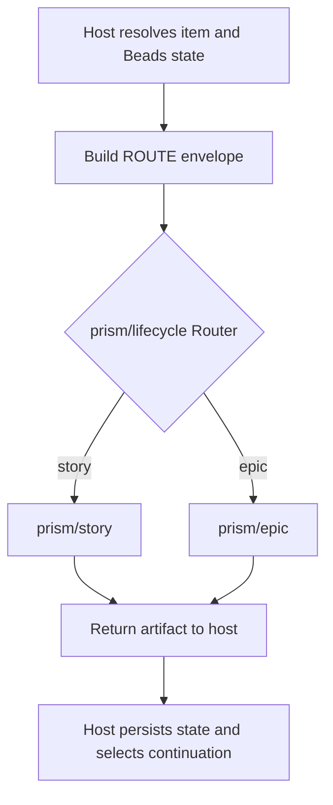

# Prism Callee Lifecycle

`prism-callee:lifecycle` is the host integration for the specialized
`prism/*` Callee pack. The host owns durable state and authorization; Callee
owns deterministic execution of the selected Story or Epic graph.

## Public UX and internal runtime

The public user entrypoint accepts an ordinary request:

```text
$prism-callee:lifecycle Add CSV export to the report page.
```

The host resolves or creates the Beads item, loads its durable context, and
constructs the internal Callee message. The operator never supplies a route
envelope.

The imported pack exposes these internal runtime roots:

| Agent | Required kind | Responsibility |
| --- | --- | --- |
| `prism/lifecycle` | Router | Select exactly one Story or Epic route |
| `prism/story` | Sequential | Six-phase direct Story graph |
| `prism/epic` | Sequential | Six-phase direct Epic graph |



The envelope begins with exactly `ROUTE=story` or `ROUTE=epic` and preserves
the original operator request plus current Beads context. Blank, malformed, and
unknown routes fail closed; the Router has no default branch and never retries
another graph.

## Ownership boundary

The host owns:

- target and Task-parent resolution;
- Beads reads, writes, labels, child selection, and persistence;
- approval authority and open-Epic batch coordination;
- continuation after every Callee return.

Callee owns only the selected graph's phase roles, scripts, Human steps, loops,
and returned artifact. Direct Callee graphs do not independently mutate the
host's durable lifecycle state.

The hierarchy is Epic → Story → Task. Epic approval covers only Epic
architecture and roadmap and never approves a child Story.

## Approval and output

Normal routing, phase, status, blocker, and error output does not emit an
unsolicited `### Acceptance criteria` section. The complete current-item
acceptance is included in the informed Callee Story Human or Epic Approval
request, and may also be shown after an explicit operator request. Approval is
stored only on the item being approved.

## Catalog installation and updates

Initial import:

```sh
callee agent import baldaworks/prism-callee \
  --path pack/callee/prism \
  --prefix prism
```

Update or repair an existing import:

```sh
callee agent import baldaworks/prism-callee \
  --path pack/callee/prism \
  --prefix prism \
  --force
```

Verify the default catalog before runtime:

```sh
callee agent list | grep '^prism/'
callee agent view prism/lifecycle --json
callee agent view prism/story --json
callee agent view prism/epic --json
```

`prism/lifecycle` must report kind `Router`, and all three public roots must be
present. A `Sequential` lifecycle or missing Story/Epic root is a stale import:
stop before execution and re-import with `--force`. Do not compensate by
running a direct graph or adding `--agent-root pack/callee` to normal runtime.

`--agent-root pack/callee` is reserved for validating the checked-in pack while
maintaining this repository.

## Internal runner ABI

The command below is a maintainer/debug surface for an already resolved item.
It is not the public Prism Callee UX: it does not create or resolve the item,
own lifecycle persistence, or replace the host wrapper.

```sh
envelope='ROUTE=story
ITEM_ID=prism-...
ITEM_TYPE=story
ORIGINAL_REQUEST:
...
BEADS_CONTEXT:
...'
callee agent run prism/lifecycle --message "$envelope"
```

## Sources

| Surface | Source |
| --- | --- |
| Host wrapper | `plugins/prism-callee/skills/lifecycle/` |
| Flat wrapper | `plugins/prism-callee/prefixed-skills/prism-callee-lifecycle/` |
| Callee pack | `pack/callee/prism/` |

Host and pack digests are recorded in `docs/lifecycle-ownership.json`.
